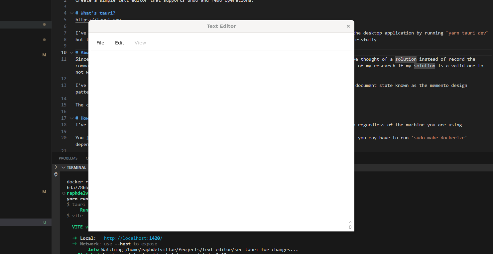

# Text Editor Problem
Create a simple text editor that supports undo and redo operations.

# What's tauri?
https://tauri.app

I've used tauri to experiment on having the application launch as a desktop application. You can launch the desktop application by running `yarn tauri dev`
but there are some rust specific dependencies that you have to install in order to be able to run it successfully

Here is a picture of it running on my machine:

# About my solution
Since one of the design constraints is not to use saving the snapshot of the complete document state, I've thought of a solution instead to record the commands the user inputs in the text area. Before I implemented my solution I did a google search as part of my research if my solution is a valid one to not waste too much time with trial and error.

I've found out that there is 2 way to implement this, one is through saving the snapshot of the complete document state known as the memento design pattern. I've found a similar pattern to the solution i'm thinking of which is the command pattern.

The command pattern would ensure that only snippets of the changes are saved.

I had problems with the command pattern where it is more complex because I have to react to every command that the user executes:

copy (ctrl + c)
paste (ctrl + v)
enter
backspace
selection and then cutting (ctrl + x)
selection and then doing backspace
selection and then typing

Granted there are commands here that I haven't caught but I would just leave that to be an edge case scenario

I've also implemented a way to check if the user cursor is in the text area to only catch commands that have been executed in that space

# Conversation with Product Manager
This is how I imagined my conversation with the product manager would be like:

PM: Hi, Raph! We need to create a feature similar to a text editor
Me: Sure, what would be the context and what functionality are they expecting for this project?
PM: They would like to implement a text editor on our platform but they want it to be built in-house which means they don't want to use any library for it so we have to build it from scratch, for the functionality that they expect for the project for now it would be that they are able to type in the document and are able to do undo and redo functionality
Me: Ok, would we be needing to implement other features as well?
PM: For now, that is the only functionality they wanted to be implemented
Me: Ok, for the UI is there any design docs? or any design in mind?
PM: For now, you can take a look at different text editors. I assume you would be needing a spike for this before you can give me an estimate?
Me: Yes, I'll create a spike ticket and work on it and will let you know my high-level estimates

At this point, I would do the spike and give a high level estimate based on the functionality they require and try to catch some edge cases as well this early on -- I would then try to set up a meeting with the developers that would be working on this so that they would have information and are ready to work on the project going forward, finally I would inform the product manager of any risks and potential issues or any concerns raised by the team.

# How to run?
I've created a makefile for you to be able to run and a docker file just to ensure that it is able to run regardless of the machine you are using. 

You just need to install docker in your system, what I use is portainer and just execute `make dockerize` you may have to run `sudo make dockerize` depending on the machine you are using

You should then be able to visit `localhost:3000` and the text editor should appear

# What am I seeing?
I've looked at the current windows notepad as a source of inspiration for the UI and so I've implemented a similar design. 

File > New - this will basically reload the app to it's initial state
Edit > Undo - this will execute the undo function which you can also execute using the shortcut `ctrl + shift + <`
Edit > Redo - this will execute the redo function which you can also execute using the shortcut `ctrl + shift + >`

Note that I've disabled `ctrl + z` and `ctrl + y` since both commands actually works in the browser

# Final notes
Thank you for your time with reviewing this code. Any feedback is also appreciated :)